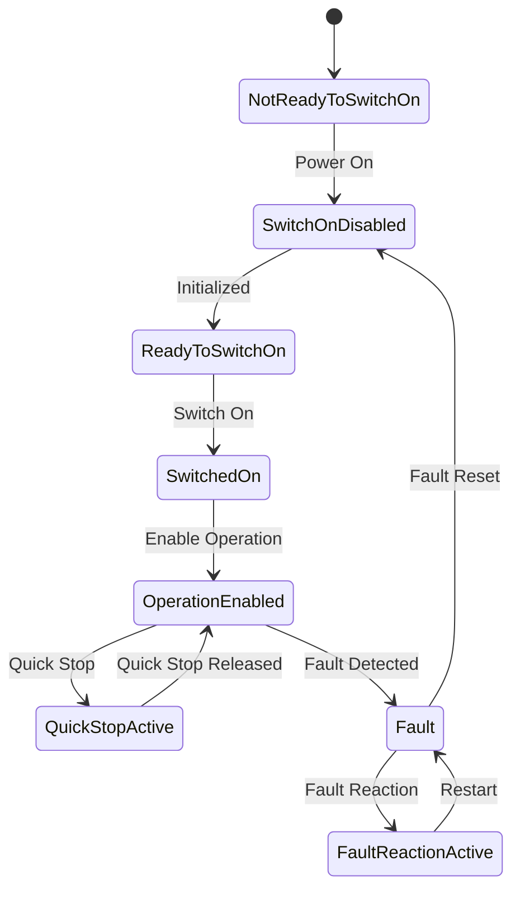

# module_dsp402

[](https://github.com/robotkernel-hal/module_dsp402/actions/workflows/build-deb.yaml)
[](LICENSE)
[](#)
[](#)
[](#)

**Robotkernel‑5 handler module for implementing the CiA DSP‑402 state machine per axis**

This module wraps the **DSP‑402** drive-control state machine (CiA 402) to simplify interaction with EtherCAT-connected axes using `Controlword` / `Statusword`. It synchronizes drive commands and states via Robotkernel triggers and axis-level abstraction.

---

## ✨ Features

- Implements full CiA DSP‑402 drive state transitions  
- Maps EtherCAT PDO process data (`Statusword`/`Controlword`) to axis logic  
- Flexible YAML configuration via named devices or class‑instance templates  
- Trigger‑based synchronization on inputs and outputs  
- Supports multiple axes neatly handled via loop or templates  

---

## 🧩 Configuration

### Simple Single-Axis Setup

```yaml
- name: dsp402
  so_file: libmodule_dsp402.so
  config:
    devices:
    - name: axis_0
      pdin: ecat.slave_1.inputs.pd
      pdin_trigger: ecat.slave_1.inputs.trigger
      pdout: ecat.slave_1.outputs.pd
      pdout_trigger: ecat.slave_1.outputs.trigger
      status_word_name: Statusword
      control_word_name: Controlword
  power_up: op
  depends: [ ecat ]
```

### Axis Template with Multiple Instances

```yaml
- name: dsp402
  so_file: libmodule_dsp402.so
  config:
    classes:
      axis_template:
        name: ($axis_name)
        pdin: ($inputs_name).pd
        pdin_trigger: ($inputs_name).trigger
        pdout: ($outputs_name).pd
        pdout_trigger: ($outputs_name).trigger
        status_word_name: Statusword
        control_word_name: Controlword
    instances:
      - { use_class: axis_template, axis_name: axis_1, inputs_name: ecat.slave_1.inputs, outputs_name: ecat.slave_1.outputs }
      - { use_class: axis_template, axis_name: axis_2, inputs_name: ecat.slave_2.inputs, outputs_name: ecat.slave_2.outputs }
  power_up: op
  depends: [ ecat ]
```

### Complete Template

```yaml
# Configuration file for PULSAR DSP402 module.
#
# vi: set ft=yaml nowrap:
# -*- mode: yaml -*-

#########################################################
# logging settings

# Standard robotkernel loglevel.
loglevel: info

#########################################################
# devices
devices:
- 
  # Local instance Name
  name: axis_0
  
  # Name of the input process data
  pdin: ecat.slave_1.inputs.pd

  # Trigger of the input process data
  pdin_trigger: ecat.slave_1.inputs.trigger

  # Name of the output process data
  pdout: ecat.slave_1.outputs.pd

  # Trigger of the output process data
  pdout_trigger: ecat.slave_1.outputs.trigger

  # Name of the Status Word in <pdin>
  status_word_name: Statusword

  # Name of the Control Word in <pdout>
  control_word_name: Controlword
```


---

## ⚙️ Mapping and Behavior

- **`pdin` / `pdin_trigger`**: Input PDO device and its associated trigger signal  
- **`pdout` / `pdout_trigger`**: Output PDO device and its trigger  
- **`status_word_name`**, **`control_word_name`**: Field names within the PDO frames for DSP‑402 state logic  
- The module processes each axis individually, driving transitions based on received `Statusword` and desired states.

---

## 🖼️ State Machine Diagram



---

## 🔧 Tips & Best Practices

- Align `pdin_trigger` and `pdout_trigger` with Robotkernel’s cycle to ensure proper axis timing.  
- One `Statusword`/`Controlword` pair per axis only.  
- Confirm each EtherCAT slave is in **Operational** mode for DSP‑402 behavior to be valid.

---

## 📦 Build & Installation

Please make sure that the prerequisites are installed. These are:

robotkernel

Then you should be able to build module_dsp402 with:

```bash
git clone https://github.com/robotkernel-hal/module_dsp402.git
cd module_dsp402
./bootstrap.sh
autoreconf -i -f
mkdir build && cd build
../configure
make
sudo make install
```

---

## 🧪 Testing

```bash
ctest
```

Use Robotkernel runtime with simulated or real EtherCAT PDO frames for validation.

---

## 🤝 Contributing

Contributions welcome! Please ensure:

- Consistent builds using autotools
- No compiler warnings
- Code follows robotkernel coding rules  
- New features accompanied by tests  
- CI workflows pass successfully before submitting PR  

---

## 📄 License

Licensed under the **LGPL-V3 License**. See the [LICENSE](LICENSE) file.

---

**Robotkernel HAL Project** – powering real-time robotics infrastructure with modular, modern C++
